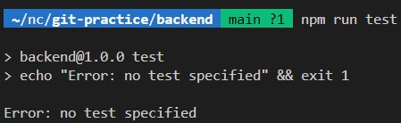

## Express 專案

### 1. `package.json` 中的 `dependencies` 與 `devDependencies` 分別是什麼

- `dependencies`：

  專案運行或是應用程式正式上線時，所需的所有套件
  透過 `npm install <package-name>` 安裝的都會在這裡
  e.g. 後端框架 （Express）、資料庫（mysql2）、環境變數 (dotenv) 等等

- `devDependencies`：

  只有在「開發或測試」的時候需要的套件，安裝時要加上`--save-dev`

  e.g. 測試工具（Jest）、程式碼檢查工具（ESLint）

### 2. `package.json` 中的 scripts 這個區塊怎麼用？

可在 scripts 區塊自定義一些常見的命令，通常跑測試時會用到

透過 `npm run <script-name>` 執行這些命令

剛建起來的預設 script 裡面已經有 `test` 指令，執行結果如下



### 3. Port number 要怎麼以環境變數來設定？

1. 安裝 `dotenv` 模組，專門用來載入 `.env` 檔案中環境變數的模組

`npm install dotenv`

2. 在專案目錄下建立一個 `.env` 檔案，在裡面設定我們的環境變數

   ```makefile
     PORT=3000
   ```

3. 改 `app.js` 的 PORT 設定，使其可以讀到 `.env` 檔案中的環境變數

```javascript
require("dotenv").config(); // 載入 dotenv 套件
const port = process.env.PORT; // 使用環境變數中的 PORT
```

這樣就可以改掉原先寫死的 port，未來想更換 port 就到 `.env` 修改，而不用動到 `app.js`

#### 補充 : process

是 Node.js 內建的全域物件 (Global object)，不需要 "require" 就可以使用它。process 代表的是當前 Node.js 執行的程式的相關資訊，像是環境變數、目前的工作目錄、記憶體使用情況等，都可以從 process 取得。

### 4. 關於哪些檔案應該要被放上 github repo 這個問題，描述看看為什麼你選擇上傳某些檔案、選擇不上傳某些檔案，決策的要素是什麼？

#### 要上傳

- `package.json` 和 `package-lock.json` : 代表我的專案所需的套件與對應版本，讓其他開發人員能跟我有相同環境

- 主程式 : `app.js`，專案主要的功能

#### 不上傳

- `node_modules`：專案要用到的所有套件，很佔空間，不用上傳，可以根據 `package.json` 來自動下載所需的套件

- `.env` : 專案相關的敏感資訊 e.g. API 金鑰、資料庫密碼，因此也不能公開上傳

### 5. 範例程式中用 require，但上週的 Stack 是用 import/export，這兩種分別是 JavaScript 引用模組的兩種方式: CJS vs ESM，這兩者分別怎麼用？

| 特性    | CommonJS (CJS)                                                | ECMAScript Modules (ESM)                                              |
| ------- | ------------------------------------------------------------- | --------------------------------------------------------------------- |
| 介紹    | Node.js 原生的模組系統                                        | JavaScript 官方的標準模組系統                                         |
| import  | 使用 `require` 關鍵字<br>例如 : `require("dotenv").config();` | 使用 `import` 關鍵字<br>例如 : `import Stack from "./stack.js";`      |
| exports | `module.exports = { ... }` 或 `exports.func = ...`            | `export default { ... }` 或 `export const func = ...`                 |
| 副檔名  | `.js`                                                         | `.mjs` 或 <br>`.js` （需在 `package.json` 中加入 `"type": "module"`） |

注意

- ESM 和 CJS 是不相容的模塊系統，不能在 ES6 模塊和 CommonJS 模塊之間進行導入和導出
- ESM 是目前主流，不過在很多 Node.js 後端開發中，CJS 仍被廣泛使用

### 參考資料

- [Specifying dependencies and devDependencies in a package.json file](https://docs.npmjs.com/specifying-dependencies-and-devdependencies-in-a-package-json-file)
- [[Node] 環境變數設置 NODE_ENV (environment variable)](https://pjchender.dev/nodejs/node-env/)
- [程式語言 - Javascript】 ESM 與 CJS](https://vocus.cc/article/649cc0e0fd89780001a7d34d)
