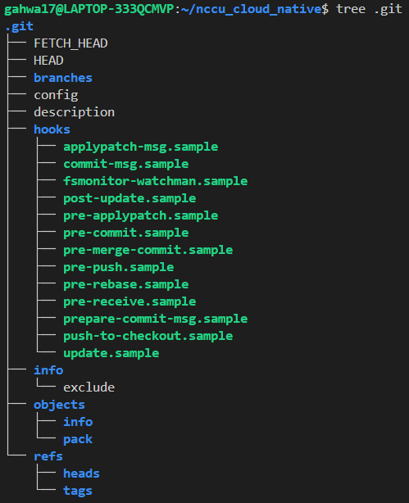

- 說明 blob, tree, commit, branch, head 分別是什麼

# Blob (Binary Large Object)

Blob 是 git 中最小的文件單位，當我們寫專案，希望 git 能去追蹤我們修改後的檔案，git 會將文件的內容作為一個 blob 對象存儲，並且回給我們一個鍵值 SHA-1(40 位的雜湊值)，相當於這個 blob 的身分證(ID)，之後我們就可以這個 ID 來找到文件的內容

> 透過指令 `git cat-file -p <blob-id>` 來查看 git 追蹤到這份文件在某個版本時的原始內容

2. Tree

   git 中的目錄結構，類似於 folder，幫我們把一組文件存在一起，他會指向 blob(文件) 和其他 tree(子目錄)，這樣能方便讓 git 建立整個專案文件的全貌

   > 透過指令 `git cat-file -p <tree-id>` 來查看某次 commit 中，Git 追蹤了哪些文件

3. Commit
   一個 commit 就像是我們專案的一個「版本」，紀錄了專案在某個特定時間點的狀態，每個 commit 都包含以下資訊：

   - SHA-1 ID：commit 的唯一識別碼
   - Author：表示誰進行了這次提交
   - Date：記錄這次提交的時間戳
   - Commit message：我們 git commit -m 所留下的訊息

   ### 如何查看 commit 資訊？

   1. `git log -1` 查看最新一筆的 commit 記錄

   

   2. `git cat-file -p <commit-id>` 查看該 commit 的詳細內容，分別是

   

   - tree：這個 commit 所追蹤的目錄結構（指向文件和資料夾）
   - parent：上一個 commit 的 ID
   - author, committer, commit message

   3. `git cat-file -p <tree-id>` 來查看這次 commit 中，Git 追蹤了哪些文件

   

   如圖所示，Git 追蹤了 README.md、dummy-tree 等文件

   4. `git cat-file -p <blob-id>` 查看文件的原始內容

   

   如圖所示，可以看到 video.md 寫了我的影片心得

4. Branch
   Branch 本質上是一個指向 commit 的指標。白話來說就是個「分類貼紙」，貼在某個特定的 commit 上，方便我們追蹤和管理開發進度，這邊推薦搭配視覺化 git 工具 [visualizing-git](https://git-school.github.io/visualizing-git/) 來理解

   在剛建立 Git repository 時，預設就會有 main 或 master branch，通常用來代表專案的主要開發線，之後穩定的版本和功能都會合併回這個分支上。
   

   開發時，我們通常會為不同的功能開出各自的 branch。例如電商平台在開發購物車功能時，會建立 shoppingcar branch。我們在這個分支上開發時，所有的 commit 都會標記在這個分支上，讓不同功能分開來，不會互相干擾。
   

   當我們在 shoppingcar branch 上進行 commit 時，branch 會自動指向最新的 commit。也就是說，每當我們完成一個 commit，branch 的「分類貼紙」會自動貼到最新的 commit 上，保持追蹤當前的最新修改。
   

5. Head

   指向我們當前所在的 branch 上，也就是我們正在工作的地方，專案剛建立，我們都是停在 master 上，隨著開發推進有多條 branch 時，可以透過 `git branch` 指令看看列出所有本地分支，而前面有 `*` 的就是 HEAD，想要切換 branch 時，就用 `git checkout <brancn_name>` 來轉換切換當前分支，HEAD 也會跟著變動。
   

   但某些時候，HEAD 也可以直接指向一個特定的提交（commit），而不是指向一個 branch ，稱為「分離 HEAD」狀態

   例如，我透過 git checkout 來切換到很久以前某個 commit 上，這時系統就會跳出警告如下圖:
   

   再分離狀態下，我們做的修改不會影響任何分支，通常發生在我們不想修改現有分支的情況下，回頭看過去某個特定版本，是個非常強大的功能

   但如果真的有甚麼修改是想保存的，可以看到 git 建議我們使用 `git switch -c <new-branch-name>` 來建立一個新的分支，以確保的內容不會消失

   最後，`git checkout -` 可以回到前一次所在的分支

# 紀錄在 git repo 操作過程中，.git 檔案夾裡的變化，看看你可以觀察到什麼

初次建立 git repo 時，我們都知道要下 git init，但這句指令背後究竟發生了甚麼事?
git 會幫我們自動生成一個名為 `.git` 的隱藏資料夾，這個資料夾是 git 專案的核心。所有的版本控制、分支、commit 歷史等資料都儲存在這裡，我們用 `tree .git` 可以看到以下內容:

下列說明幾個重要的檔案與資料夾

- config：專案的 Git 配置，例如 remote repo URL 或是 local/remote 的 branch 對應關係
  

- objects：儲存所有 Git 中的物件，包括 blobs（檔案內容）、trees（目錄樹結構）、commits（提交資訊）

- HEAD：儲存當前所在的 branch
  
  可以看到我專案現在停在 dev branch 上
- logs：記錄了每次 HEAD 的變化 ( branch 移動變化)，以及 commit 紀錄

### Git 的神秘世界：.git/objects 目錄的秘密

都說 git 會幫我們追蹤所有的「修正版本」，那是如何管理這些變來變去的程式碼和文件的呢?

當我們打開 `.git/objects` 來看，會發現一個奇妙的現象，一堆看似隨機的資料夾，每個資料夾名稱只有兩個字符，由數字與英文組成。而這些資料夾內的文件名稱，則是 38 個數字英文組成。

這些神秘的名稱大有來頭！它們是 git 為每個 object (程式碼、提交紀錄) 生成的獨特 ID，稱之為「雜湊值」，git 巧妙地把這個雜湊值拆成兩部分 : 前兩個字符用作資料夾名稱，剩下的 38 個字符則成為文件名稱。

隨著專案不斷成長，提交次數增加，會發現這個目錄下的資料夾和文件也會越來越多。

這樣的結構設計有甚麼好處呢?

1. 快速查找：想像一下，要是所有文件都擠在一個資料夾裡面，要找特定檔案會超級麻煩，所以按照雜湊值來分類多個資料夾的方式，就像是圖書館會按照不同學科把書放在不同書櫃一樣，找東西更方便囉！

2. 唯一性：這要複習到雜湊值本身的特性，他能讓每個文件的 ID 都是獨一無二的，這樣 git 可以準確地追蹤每一個修正，不會混淆不同版本

總結一下，git 這樣的設計就是個高校的圖書管理員，可以在茫茫的版本紀錄中找到我們所需的資訊，讓 git 從個人小專案到社群開源大專案，都能輕鬆 handle 住。

# commit message 應該怎麼寫比較好？應該有什麼 `style` 嗎？

參考來源:[Git Objects](https://git-scm.com/book/zh-tw/v2/Git-Internals-Git-Objects)

(以上部分內容有經過 GPT 幫忙潤稿)
