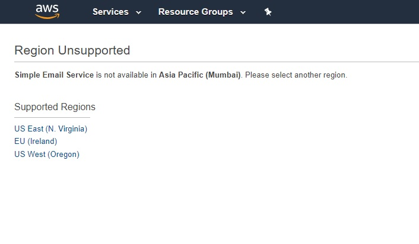

# WEEK-03 註冊 AWS 帳號

## 什麼是 AWS Region, AZ (availability zones)

### AWS Region

AWS Region 代表特定地理區域內的資料中心群組，每個 Region 下包含多個可用區 (Availability Zones, AZs)。當我們選擇一個 Region，即表示我們決定在哪個地區運行 AWS 服務。

e.g. 美國東北部或亞太地區

### AZ (availability zones)

一個 AZ 即為一個資料中心 (Data Center)，隸屬於某個 Region 底下；每個 AZ 都是獨立運作，因此當某個 AZ 故障時，也不會影響其他 AZ。這樣的設計允許在天災人禍發生時，公司可以快速切換到其他 AZ，確保產品持續運作。

## 如果你要使用 AWS 服務，你會怎麼選擇用哪個 Region，考慮的因素有哪些？

1. **政府法規**

   有些國家政府出於資料治理政策，規定資料都要留在國內，因此為了符合法規限制，只能在政府認可的區域使用 AWS 服務。

2. **顧客位置**

   公司據點雖然位於 A 區，但服務應以顧客所在地 B 區為優先縮短資料傳輸的延遲，讓資料更快抵達顧客所在地區。所以顧客在哪，區域就選在哪。

3. **服務可用性**

   有些 AWS 服務在部分地區無法使用，如圖所示

   

   _圖片來源：[Stack Overflow](https://stackoverflow.com/questions/55078339/aws-says-simple-email-service-is-not-available-in-this-region-how-to-fix-this)_

   因此使用服務前，可以先查看各區域提供的服務清單 : [按區域提供的 AWS 服務清單](https://aws.amazon.com/tw/about-aws/global-infrastructure/regional-product-services/?p=gi)

4. **預算**

   不同地區的服務計價方式不同，到 [比價網站](https://instances.vantage.sh/) 看 EC2 Regoin 時可觀察到 US 普遍比較便宜。

### 資料參考

- [How to choose RIGHT AWS Region | What is AWS Region and Availability Zone](https://www.youtube.com/watch?v=Kv3b48fKcUY&t=5s&ab_channel=CloudChamp)
