## 查看錯誤訊息們
* `curl localhost`
    
    


* `sudo systemctl start nginx`
    
    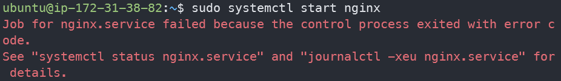
    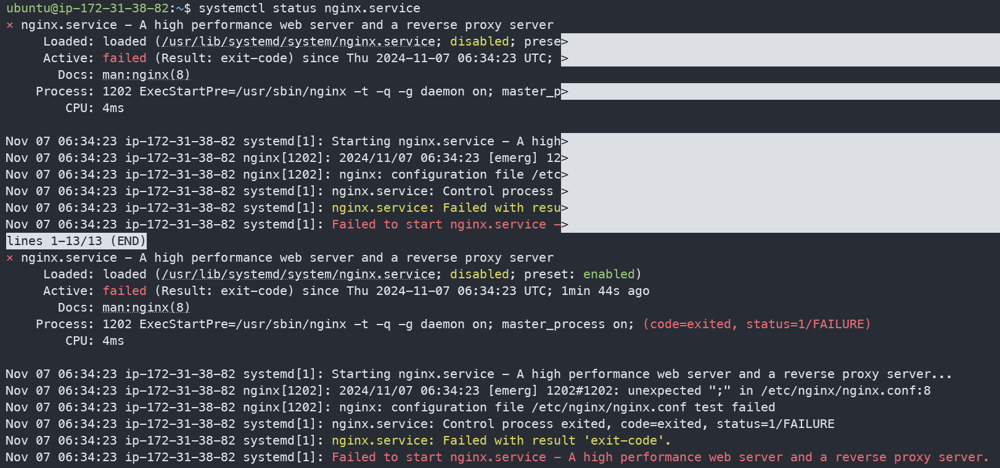

* `sudo systemctl start nginx`
    ```
    Job for nginx.service failed because the control process exited with error code.
    See "systemctl status nginx.service" and "journalctl -xeu nginx.service" for details.
    ubuntu@ip-172-31-38-82:~$ journalctl -xeu nginx.service
    ░░
    ░░ The job identifier is 1703 and the job result is failed.
    Nov 07 06:37:56 ip-172-31-38-82 systemd[1]: Starting nginx.service - A high performance web server and a reverse proxy server...
    ░░ Subject: A start job for unit nginx.service has begun execution
    ░░ Defined-By: systemd
    ░░ Support: http://www.ubuntu.com/support
    ░░
    ░░ A start job for unit nginx.service has begun execution.
    ░░
    ░░ The job identifier is 1811.
    Nov 07 06:37:56 ip-172-31-38-82 nginx[1214]: 2024/11/07 06:37:56 [emerg] 1214#1214: unexpected ";" in /etc/nginx/nginx.conf:8
    Nov 07 06:37:56 ip-172-31-38-82 nginx[1214]: nginx: configuration file /etc/nginx/nginx.conf test failed
    Nov 07 06:37:56 ip-172-31-38-82 systemd[1]: nginx.service: Control process exited, code=exited, status=1/FAILURE
    ░░ ...
    ░░
    ░░ A start job for unit nginx.service has finished with a failure.
    ░░
    ░░ The job identifier is 1811 and the job result is failed.```

* `sudo systemctl status nginx`
    ```
    ubuntu@ip-172-31-38-82:~$ 
    × nginx.service - A high performance web server and a reverse proxy server
         Loaded: loaded (/usr/lib/systemd/system/nginx.service; disabled; preset: enab>
         Active: failed (Result: exit-code) since Thu 2024-11-07 06:45:51 UTC; 16s ago
           Docs: man:nginx(8)
        Process: 1276 ExecStartPre=/usr/sbin/nginx -t -q -g daemon on; master_process >
        Process: 1278 ExecStart=/usr/sbin/nginx -g daemon on; master_process on; (code>
            CPU: 9ms

    Nov 07 06:45:48 ip-172-31-38-82 systemd[1]: Starting nginx.service - A high perfor>
    Nov 07 06:45:48 ip-172-31-38-82 nginx[1278]: nginx: [emerg] bind() to 0.0.0.0:80 f>
    Nov 07 06:45:49 ip-172-31-38-82 nginx[1278]: nginx: [emerg] bind() to 0.0.0.0:80 f>
    Nov 07 06:45:49 ip-172-31-38-82 nginx[1278]: nginx: [emerg] bind() to 0.0.0.0:80 f>
    Nov 07 06:45:50 ip-172-31-38-82 nginx[1278]: nginx: [emerg] bind() to 0.0.0.0:80 f>
    Nov 07 06:45:50 ip-172-31-38-82 nginx[1278]: nginx: [emerg] bind() to 0.0.0.0:80 f>
    Nov 07 06:45:51 ip-172-31-38-82 nginx[1278]: nginx: [emerg] still could not bind()
    Nov 07 06:45:51 ip-172-31-38-82 systemd[1]: nginx.service: Control process exited,>
    Nov 07 06:45:51 ip-172-31-38-82 systemd[1]: nginx.service: Failed with result 'exi>
    Nov 07 06:45:51 ip-172-31-38-82 systemd[1]: Failed to start nginx.service - A high>
    lines 1-18/18 (END)...skipping...
    × nginx.service - A high performance web server and a reverse proxy server
         Loaded: loaded (/usr/lib/systemd/system/nginx.service; disabled; preset: enabled)
         Active: failed (Result: exit-code) since Thu 2024-11-07 06:45:51 UTC; 16s ago
           Docs: man:nginx(8)
        Process: 1276 ExecStartPre=/usr/sbin/nginx -t -q -g daemon on; master_process on; (code=exited, status=0/SUCCESS)
        Process: 1278 ExecStart=/usr/sbin/nginx -g daemon on; master_process on; (code=exited, status=1/FAILURE)
            CPU: 9ms

    Nov 07 06:45:48 ip-172-31-38-82 systemd[1]: Starting nginx.service - A high performance web server and a reverse proxy server...
    Nov 07 06:45:48 ip-172-31-38-82 nginx[1278]: nginx: [emerg] bind() to 0.0.0.0:80 failed (98: Address already in use)
    Nov 07 06:45:49 ip-172-31-38-82 nginx[1278]: nginx: [emerg] bind() to 0.0.0.0:80 failed (98: Address already in use)
    Nov 07 06:45:49 ip-172-31-38-82 nginx[1278]: nginx: [emerg] bind() to 0.0.0.0:80 failed (98: Address already in use)
    Nov 07 06:45:50 ip-172-31-38-82 nginx[1278]: nginx: [emerg] bind() to 0.0.0.0:80 failed (98: Address already in use)
    Nov 07 06:45:50 ip-172-31-38-82 nginx[1278]: nginx: [emerg] bind() to 0.0.0.0:80 failed (98: Address already in use)
    Nov 07 06:45:51 ip-172-31-38-82 nginx[1278]: nginx: [emerg] still could not bind()
    Nov 07 06:45:51 ip-172-31-38-82 systemd[1]: nginx.service: Control process exited, code=exited, status=1/FAILURE
    Nov 07 06:45:51 ip-172-31-38-82 systemd[1]: nginx.service: Failed with result 'exit-code'.
    Nov 07 06:45:51 ip-172-31-38-82 systemd[1]: Failed to start nginx.service - A high performance web server and a reverse proxy server.
    ```
* nginx 設定檔檢查 : `sudo nginx -t` 
  
  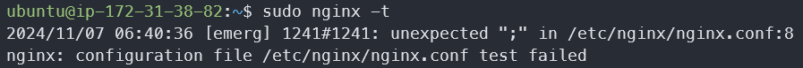


## 問題排除一 : nginx.conf 分號問題
  
  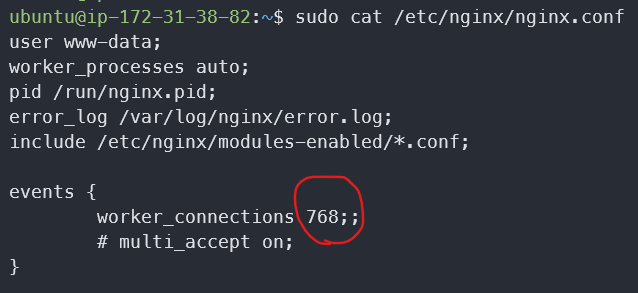

分號問題修改後再檢查一次，通過
```
sudo nginx -t
nginx: the configuration file /etc/nginx/nginx.conf syntax is ok
nginx: configuration file /etc/nginx/nginx.conf test is successful
```

## 問題排除二 : 80 port 已被佔用
### 檢查 port 80
1. `sudo lsof -i:80`
  
  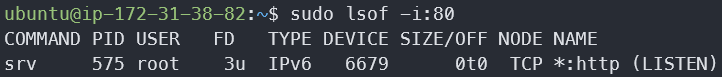
  * 列出佔用 80 端口的進程
  * 顯示 srv 進程(PID 575)正在監聽 HTTP 端口(80)


2. 看 srv 在幹嘛
  * 搜尋包含 "srv" 的進程 : `ps aux | grep srv`
    
    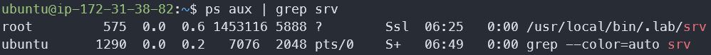
      PID 575: 運行於 `/usr/local/bin/.lab/srv`
  *  查看 srv 服務的狀態 : `systemctl status srv`
    
    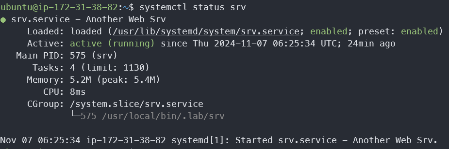

      * 服務名稱：Another Web Srv
      * 狀態：active (running)
      * 運行時間：從 2024-11-07 06:25:34 UTC 開始
      * 路徑：/usr/lib/systemd/system/srv.service


3. 現況總結：有另一個叫做 "Another Web Srv" 的服務佔用了 80 port，安裝在 `.lab` 隱藏目錄下


### 暫停 Another Web Srv
1. 使用 systemctl 來停止 : `sudo systemctl stop srv`

2. 確認是否停止 : `systemctl status srv`
  
  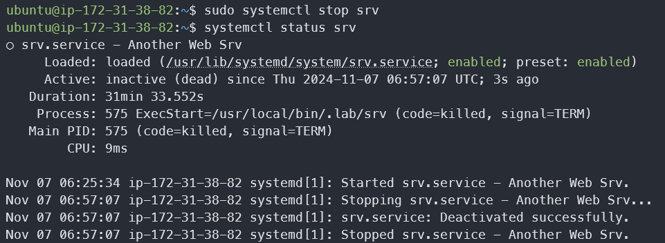

3. 確認 80 port 被釋放：`sudo lsof -i :80`

4. 檢查 Another Web Srv 是否設置為開機自動啟動 : systemctl is-enabled srv

5. 查看服務的詳細啟動配置：systemctl list-unit-files | grep srv
systemctl list-unit-files | grep srv 的輸出顯示了所有包含 "srv" 的系統服務單元檔案及其狀態：
  
  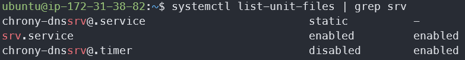


* chrony-dnssrv@.service

    * 狀態：static（靜態）
    * 這是一個 chrony（時間同步服務）相關的服務模板
    * @ 符號表示這是一個模板單元

* srv.service（這就是我們剛才看到的 web 服務）

    * 狀態：enabled（已啟用）
    * preset：enabled（預設啟用）
    * 這表明該服務會在系統啟動時自動啟動

7. 關掉 srv

```
# 禁用自動啟動
sudo systemctl disable srv

# 停止服務
sudo systemctl stop srv

# 驗證狀態
systemctl status srv
```

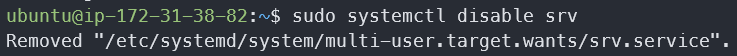
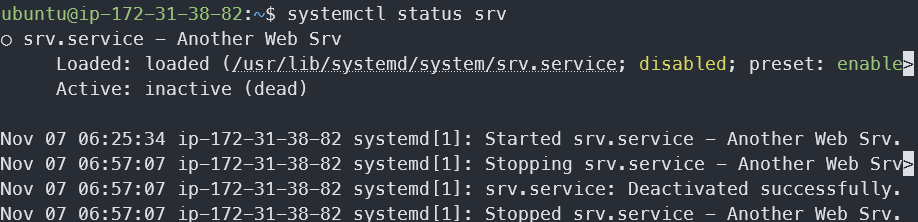


## 問題排解三 : 防火牆 INPUT RULE
1. 現狀 : 關掉 srv 服務，但 curl 仍還是失敗
2. 查看 nginx log: 
    * `sudo tail -f /var/log/nginx/error.log`
    
    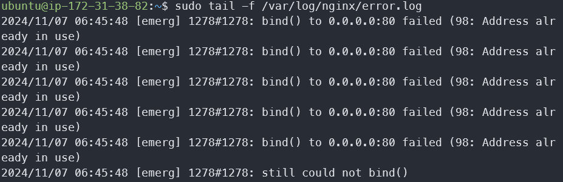
    錯誤日誌 : 2024/11/07 06:45:48 [emerg] 1278#1278: bind() to 0.0.0.0:80 failed (98: Address already in use)

3. 查看 iptable :  `sudo iptables -L -v -n`
  
  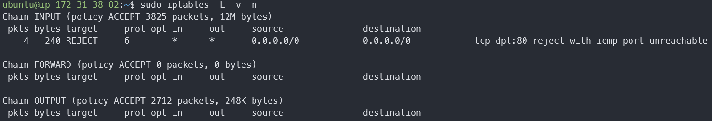

4. iptables 規則文件
    * 鏈（Chain）設置
        ```
        :INPUT ACCEPT [153:11068]    # 允許傳入連接，已處理 153 個數據包，總計 11068 字節
        :FORWARD ACCEPT [0:0]        # 允許轉發，當前無數據包
        :OUTPUT ACCEPT [0:0]         # 允許傳出，當前無數據包
        ```
    * 具體的阻擋規則
        ```
        -A INPUT -p tcp -m tcp --dport 80 -j REJECT --reject-with icmp-port-unreachable
        # 阻擋所有到 80 port 的 TCP 連接，client 會收到"端口不可達"的錯誤消息
        ```
        * -A INPUT：附加到 INPUT 鏈（處理傳入連接）
        * -p tcp：針對 TCP 協議
        * -m tcp：使用 TCP 模塊進行匹配
        * --dport 80：目標端口是 80（HTTP）
        * -j REJECT：執行 REJECT 動作
        * --reject-with icmp-port-unreachable：回應 ICMP 端口不可達消息

### 解決方案
1. 移除阻擋 80 端口的規則：
```bash
sudo iptables -D INPUT 1  # 刪除第一條INPUT規則
```

2. 保存規則（Ubuntu）：
```bash
sudo netfilter-persistent save
```
( 補坑 : 這是治標不治本，reboot 後這條規則還在，要直接去改 `ipv4.rule` 文件 )

## 問題排解四 : 權限問題 
1. 現況 : 可以 `curl localhost`，卻遇到 `403 Forbidden`
    
    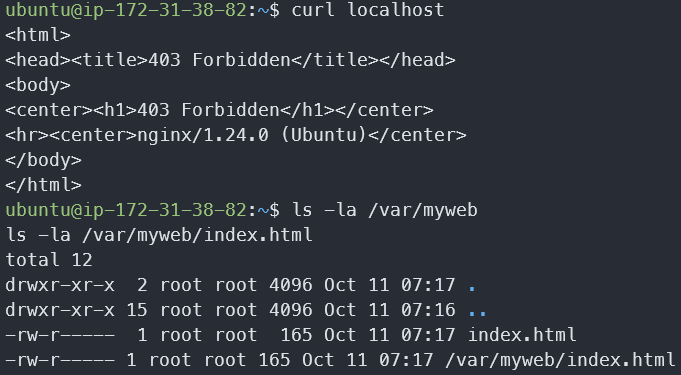
2. Nginx 錯誤訊息 : `sudo tail -f /var/log/nginx/access.log`
    
    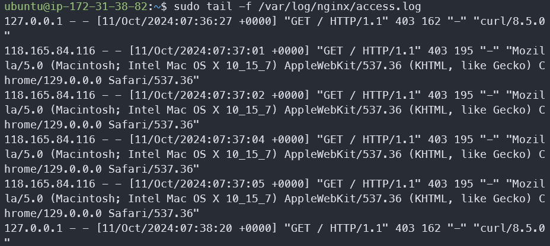
Access Log 顯示 403 Forbidden 錯誤：`"GET / HTTP/1.1" 403 162`，這表示 Nginx 可以接收請求，但拒絕訪問。常見的 403 原因：
    * 目錄權限問題
    * 缺少索引文件（index.html 等）
    * Nginx 使用者（www-data）沒有正確的文件訪問權限
3. 檢查 /var/myweb 目錄的權限：

    ```bash =
    ls -la /var/myweb
    ls -la /var/myweb/index.html
    ```

4. 修正權限：

    ```bash =
    sudo chmod 644 /var/myweb/index.html # 640 → 644
    ```

    透過 `sudo chmod 644 /var/myweb/index.html` 讓其他用戶（包括 www-data）獲得了讀取權限
    
    * Nginx 運行於 www-data 用戶
    * 原本的 640 權限下，www-data 屬於 "其他用戶"，沒有任何權限 (---)，導致 Nginx 無法讀文件
    * 改為 644 後，www-data 獲得讀取權限 (r--)，Nginx 就可以讀文件

### 能看到 Congratulations 了
  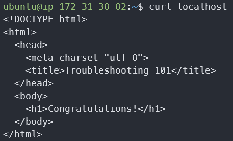

## 確保 Reboot 後也能順利執行
1. iptables 規則永久設定
    ``` bash =
    # Ubuntu 使用 netfilter-persistent
    sudo apt-get install iptables-persistent
    ```
    iptables-persistent 套件可以在開機時自動載入保存的規則，依循 `/etc/iptables/` 目錄下保存的規則

2. 修改 `iptables/rules.v4` 文件，刪除 REJECT 規則 : `sudo nano /etc/iptables/rules.v4`
3. 儲存與重載規則 : 
    ```bash =
    sudo netfilter-persistent save
    sudo netfilter-persistent reload
    ```
4. 關掉 src 的自動啟動 : `sudo systemctl disable srv.service`
4. 設定 Nginx 自動啟動 : `sudo systemctl enable nginx`
    `

## 總結

1. 讓 nginx 可以順利啟動
    - [ ] ngiunx 設定檔修正
    修改 conf.d 檔案，把第8行的分號拿掉，透過 sudo nginx -t 檢查
    - [ ] port 問題 : 停止 srv 服務，釋出 80 port
    `sudo systemctl stop srv.service`
    - [ ] nginx 根目錄文件`root /var/myweb` 改權限
    `sudo chmod 644 /var/myweb/index.html`
    - [ ] 防火牆規則 : iptables 中有阻擋 80 port 的規則
2. reboot 後仍可以啟動
    - [ ] 確保 srv 服務不會開機後又重啟
        `sudo systemctl disable srv.service`
    - [ ] iptables 規則永久保存
        1.  刪掉阻擋規則 : `/etc/iptables/rules.v4`
        2.  保存最新規則 : `sudo netfilter-persistent save`
    - [ ] 設定 Nginx 自動啟動 : `sudo systemctl enable nginx`


## 記下方便的除錯指令
``` bash = 
### 1. 服務狀態檢查
# 查看 Nginx 狀態
sudo systemctl status nginx
# 檢查服務是否設置為自動啟動
systemctl is-enabled nginx
# 查看服務配置
systemctl cat nginx.service

### 2. 端口檢查
# 查看特定端口使用情況
sudo lsof -i :80
# 查看所有監聽端口
sudo netstat -tlpn
# 查看特定進程
ps aux | grep nginx

### 3. 配置檢查
# 檢查 Nginx 配置語法
sudo nginx -t
# 查看錯誤日誌
sudo tail -f /var/log/nginx/error.log
# 查看訪問日誌
sudo tail -f /var/log/nginx/access.log

### 4. 防火牆規則檢查
# 查看當前 iptables 規則
sudo iptables -L -v -n
# 查看保存的規則
sudo cat /etc/iptables/rules.v4
# 檢查 UFW 狀態（如果使用）
sudo ufw status

### 5. 權限檢查
# 檢查目錄權限
ls -la /var/myweb
# 檢查 Nginx 運行用戶
ps aux | grep nginx
# 查看文件所有者
stat /var/myweb/index.html

### 6. 連接測試
# 本地連接測試
curl -v localhost
# 指定 IP 測試
curl -v 127.0.0.1
# 測試特定端口
telnet localhost 80
```